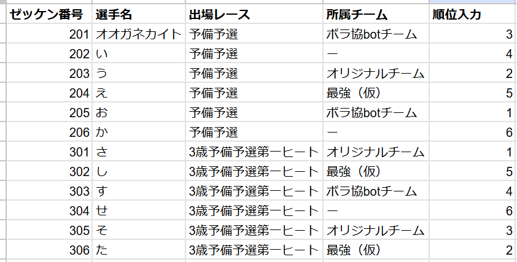
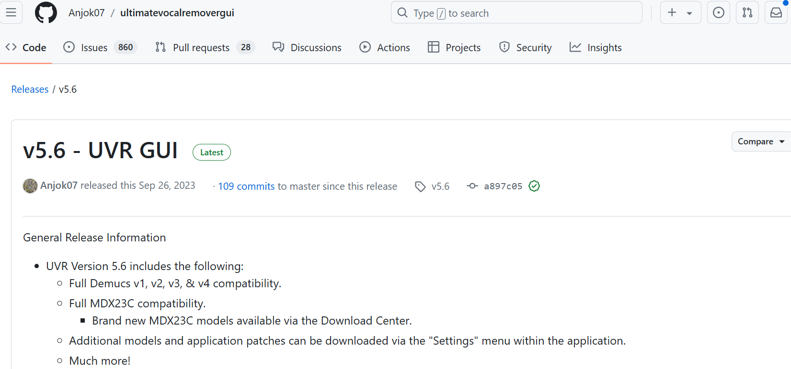
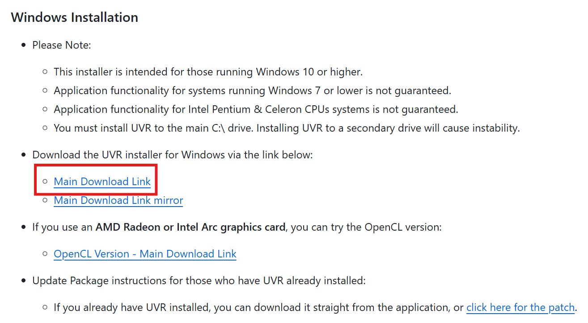
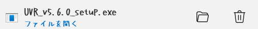

# RVCを使って好きなキャラクターに歌わせてみよう
## はじめに

## 使用するツール
### Ultimate Vocal Remover
> 曲からボーカルのみを抽出するツール

[Ultimate Vocal Remover](https://ultimatevocalremover.com/)

### RVC
> AIに音声データを渡すことで音声の特徴を学習させ、音声データを変換するツール！！
### Google Colab
> 簡単に言うとPythonというプログラミング言語のオンライン実行環境
のことです。さらにクラウド上で実行されるのでローカルのマシンスペックに依存せず、低スペックのGPUが搭載されていないPCでもGPUを利用してスクリプトを
実行することができるので計算量の多いアルゴリズムでも実行することができます！

以上、二つのツールを利用して音声変換をして好きなキャラクターに歌を歌わせていきます！

## 操作手順について
1. Ultimate Vocal Removerをインストールする！
1. 学習用データセットを準備する
1. RVCを利用して学習する

## 学習データセットを準備する

まず下のURLへ移動してください  
https://ultimatevocalremover.com/  

> URLをクリック後、上記画像のような画面に移動するのでDownload UVRをクリックしてください

](image-1.png)
> Download UVRをクリックすると上記、Githubリポジトリに移動する！

](image-3.png)
> 少し画面をスクロールするとwindows用のインストールの案内があります。今回は、赤く囲われた部分をクリックしてください！

> クリックするとEXEファイルがダウンロードされるので実行してください

下のURLから学習データ作成用のGoogle Colabへ移動してください  
[学習データ作成用](https://colab.research.google.com/drive/1GDpyoj5996r4TwaYg1ClAiTR3lCW1B7-?usp=sharing)  

