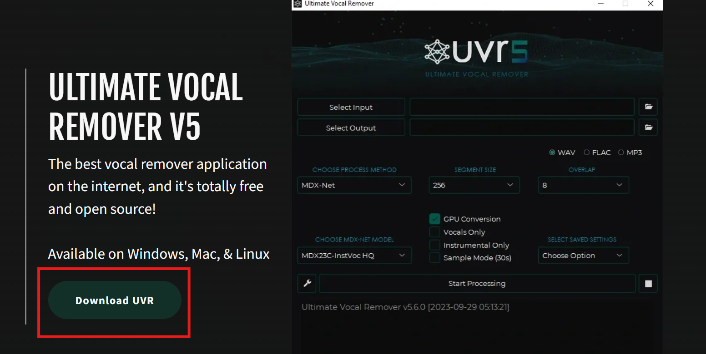

# Zenn執筆環境構築
今回の記事では私がZennを始めるにあたって構築した執筆環境について紹介していこうと思います！
## やったこと(概要)
- Git管理できるようにした！
- Qiitaにも同時に投稿！
以上二つです！
## Git管理の仕方について

1.記事の管理をクリック

2.githubとの連携をクリック

## Qiitaへの同時投稿機能の実装
GithubActionsを利用して作成しました。

## noteへの同時投稿機能の実装について

## 参考
[Qiitaとの連携方法について](https://zenn.dev/noraworld/articles/github-to-qiita-by-github-actions)  
[noteとの連携方法](https://note.com/naokun_gadget/n/naf129cb5f34b)
