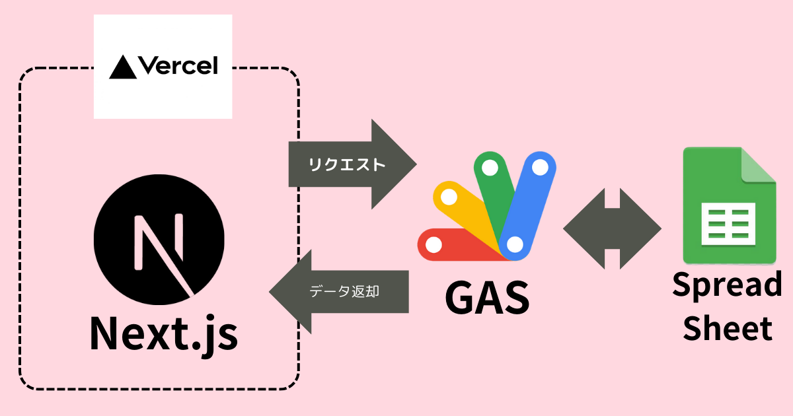
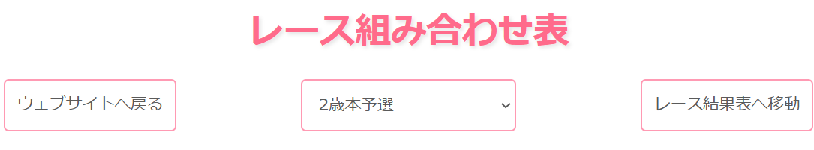
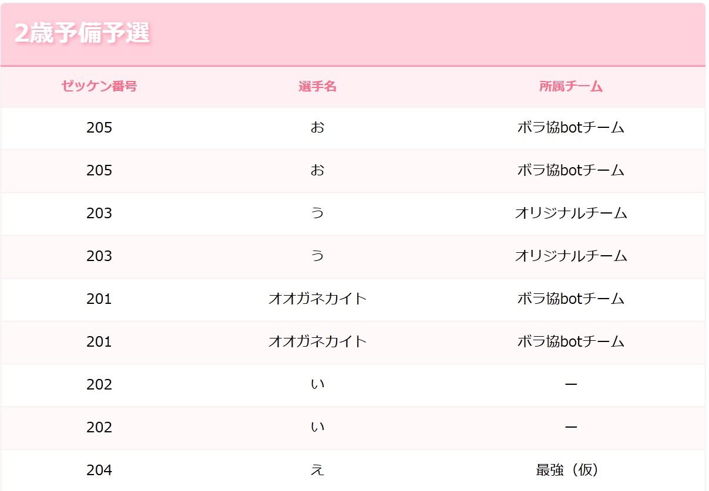
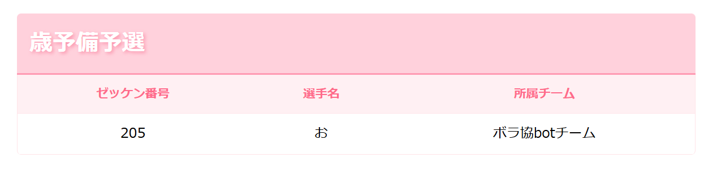
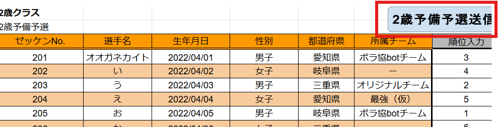
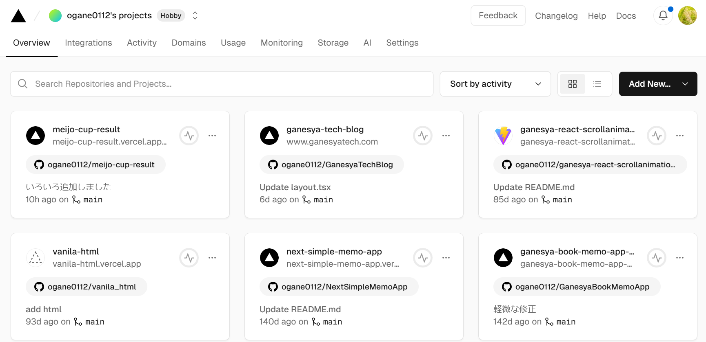
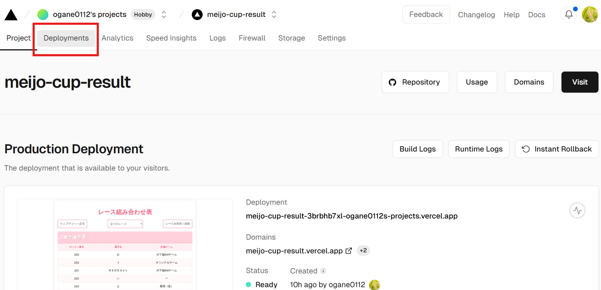
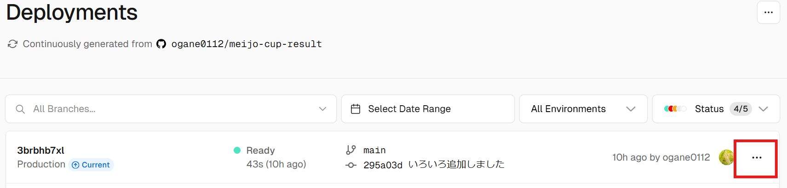
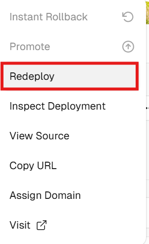
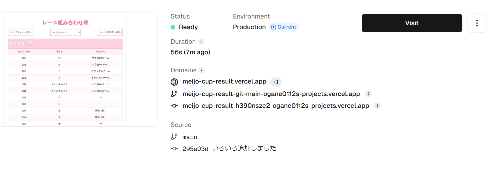

# meijo-cup-result　説明資料

---
# 目次
- 使用している技術について
- システム概略図
- フォルダー構成
- 各ソースコードの説明
-	仕様について
---
# 使用している技術
### フロントエンド
- Next.js　←　これについてはこの資料で説明します
### バックエンド
- Google Apps Scripts　←　これについては説明しません
### ホスティング
- Vercel　←　口頭で説明予定
---

# 概略図


---
# フォルダー構成
```sh
app
│  favicon.ico
│  globals.css
│  layout.js
│  mushin.otf
│  opengraph-image.jpg
│  page.js
│  twitter-image.jpg
│
├─api
│  └─hello
│          route.js
│
└─components
        Footer.jsx
        Header.jsx
        Result.jsx
        result.module.css
        SlideShow.jsx
```
---
# layout.jsについて
> 全体のソースコード
```js
import "@/app/globals.css"

export const metadata = {
  title: "第2回名城CUPレース結果",
  description: "第2回名城CUPのレース結果を確認することができます",
};
export default function RootLayout({ children }) {
  return (
    <html lang="ja">
      <body>
        {children}
      </body>
    </html>
  );
}
```
> Next.jsの重要なファイルでエントリーポイントになる！！！という認識でOK
※ちなみに消しても復活します。あと気にしなくてよいです
---
# layout.jsについて
```js
export default function RootLayout({ children }) {
  return (
    <html lang="ja">
      <body>
        {children}
      </body>
    </html>
  );
}

```
> この{children}の部分にpage.jsの内容がはいる。
ちなみにurlをクリックして初めに出るページがlayout.jsというイメージでとりまOK(雑すぎるが...)
---
# layout.jsについて
```js
import "@/app/globals.css"

export const metadata = {
  title: "第2回名城CUPレース結果",
  description: "第2回名城CUPのレース結果を確認することができます",
};
```
> import の部分はCSSをimportしています。これによりすべてのページでglobal.cssに書かれたレイアウトが反映されます.　　
export const meta の部分は,htmlでいうheadタグに書かれるtitleとdescriptionを設定しています.
---
# page.jsについて
> 全体のソースコード
```js  
import Result from "@/app/components/Result"

export default async function Page() {
  const rep = await fetch(process.env.NEXT_PUBLIC_API_URL);
  const data = await rep.json();

  console.log(data)
     
  return (
         <main>
              <Result data={data} />
         </main> 
  );
}
```
---
# page.jsについて
```js
import Result from "@/app/components/Result"
```
> componentsフォルダー内にあるResult.jsxをimportしている
importすることでResultコンポーネントとして利用することができる.

---
# page.jsについて
```js
export default async function Page() {
  const rep = await fetch(process.env.NEXT_PUBLIC_API_URL);
  const data = await rep.json();
　便宜上省略...
}
```
> fetch関数について
Next.jsの関数は,通常のjsのfetch関数が拡張されていて,
特に指定しない場合,getリクエストを送信される。
今回は.スプレッドシートのデータを取得するために使用
---
# page.jsについて
```js
export default async function Page() {
  const rep = await fetch(process.env.NEXT_PUBLIC_API_URL);
  const data = await rep.json();
　便宜上省略...
}
```
> 定数 repにはHTTPレスポンスの結果が入る！
ちなみにHTTPのbodyの中にスプレッドシートのデータが入っている！！
なのでjson()という関数を使うとbodyを読み取ることで
スプレッドシートのデータを取得することができる！！


---
# page.jsについて(補足)
> **HTTPレスポンス**
```js
Response {
  status: 200,
  statusText: '',
  .........省略............
```
> **スプレッドシートのデータ(HTTPレスポンスのbody部分)**
```js
[
   {
    'ゼッケン番号': ,
    '選手名': 'オオガネカイト',
    '出場レース': '予備予選',
    '所属チーム': 'ボラ協botチーム',
    '順位入力': 3
   } ,
   ......スプレッドシートのDBシート行数分だけデータが増えます！
]
```
---
# page.jsについて
```js
 export default async function Page() {
  const rep = await fetch(process.env.NEXT_PUBLIC_API_URL);
  const data = await rep.json();
  console.log(data)    
  return (
         <main>
              <Result data={data} />
         </main> 
  );
}
```
> <Result data={data}>でコンポーネント間のデータのやり取りをしている(fetchで取得したスプレッドシートのdataを受け渡していると

---
# Result.jsxについて
```js
。。資料では省略！！知りたかったら聞いてね( ´∀｀ )
```
>　指定されたレース結果(決勝の結果)のみを表示させるためのコンポーネント
---
# combine.jsx
```JS
省略
```
> 組み合わせを表示させるためのコンポーネント
---
# 仕様について
### セレクトボタンについて

> 画像のセレクトを変更する事で特定のレースの組み合わせを確認すること
ができる
---
# 仕様について
### サイト間の移動と結果と組み合わせ表の移動について

> 画像にある左右両端にあるウェブサイトへ戻るで元の公式サイトに戻ることができ、レース結果表へ移動をクリックすることでレースの結果表へ移動することができます！

---
# 仕様について
### 重複データがある場合(複数回、同じデータを送信してしもた場合)

> 画像のように複数表示されてしまうので注意

---
# 仕様について
### レース名の入力が違う場合

> 画像のように一人だけ別の表として作成されてしまうため注意！
(画像は本来２歳予備予選の人が別表で表示されてしまっている(´;ω;｀))
---
# 運用方法
1. 組み合わせまたは結果がわかったらスプレッドシートのDB送信ボタンをクリックする！
1. 変更を反映させるためにVercelにてリデプロイを行う
1. 以上、二つを組み合わせや結果を伝えたいときに行う！
> ※注意
もしDB送信にミスなどがあった場合、スプレッドシートのDBシートのミスの該当箇所を修正し2のリデプロイの操作をする必要があります。
---
# 運用方法
### 1. スプレッドシートのDB送信ボタンをクリックする！

> 画像の赤枠のボタンが組み合わせ毎にあるので組み合わせが決定次第、
ミスがないか確認してからクリックしてください！
---
# 運用方法
### 2.Vercelにてリデプロイを行う！

> ↓のURLよりVERCELへアクセスすると画像のような画面になるので該当のプロジェクトを開く
https://vercel.com/
---
# 運用方法
### 2.Vercelにてリデプロイを行う
> プロジェクトを開くと右のような画面になるので赤枠部分をクリック！(Deployments)


---
# 運用方法
### 2.Vercelにてリデプロイを行う


> 先ほどの操作をするとこのような画面になるので赤枠ボタンをクリック！！！！
※一番上のものが最新のデプロイなので必ず一番上をクリックしてください！
---
# 運用方法
### 2.Vercelにてリデプロイを行う！


> ←のようなセレクトメニューが出てくるのでRedeployを選択
以上で操作は終わりです！！！
---
# 運用方法
### 2.Vercelにてリデプロイを行う！

> 上記のような画面になっていれば成功です！！